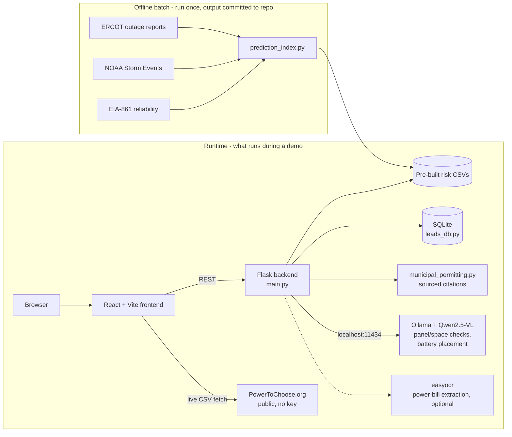

# ResilianceROI — Intelligent Battery Lead Qualifier

A lead-qualification funnel for Base Power (whole-home battery, sold as a subscription
add-on to their fixed-rate energy plan) that replaces generic screening questions with
real, address-specific severe-weather/grid-risk data — then carries that same qualified
lead through photo-based site survey, AR-style battery placement, permitting lookup, and
scheduling, instead of dropping it at "email us."

## Quick start

No API keys, no cloud accounts, no signup required for anything below — everything runs
locally against data that ships pre-built in the repo.

```bash
# 1. Backend (Flask, Python 3.11+)
cd backend
pip install -r requirements.txt
python main.py
# -> http://localhost:8000  (check: /health, /data-status)

# 2. Frontend (React + Vite), in a second terminal
cd frontend
npm install
npm run dev
# -> prints the local URL (usually http://localhost:3000)
```

Open the printed frontend URL. Try ZIP **77001** (Houston) or **75201** (Dallas) to see
real risk data end to end. `#/compare` in the app shows Base's live funnel side by side
with this one.

Everything above is required for the core funnel. Two backend features are **optional**
and degrade gracefully if skipped — see [Known limitations](#known-limitations--next-steps):
- Site-survey "see it in your space" photo placement — needs [Ollama](https://ollama.com) running locally
- Power-bill photo upload (OCR) — needs `pip install easyocr pillow` (not in
  `requirements.txt` since it's optional; its `torch` dependency can also fail to load
  under some Windows security policies — see below)

## The problem

Base's live funnel asks questions that don't qualify anyone ("what's your main reason
for considering Base?"), asks the same thing twice in different words (provider choice),
and dead-ends customers who already own a battery with a manual mailto link. See
`frontend/src/before/CurrentFunnel.tsx` for a faithful reproduction, and `/compare` in
the running app for a side-by-side against what we built.

## What we built

**Real data, not hype.** A per-ZIP severe-weather/grid-risk index built from:
- **ERCOT** Unplanned Resource Outages Report — 364 daily zip reports, deduped to
  unique outages, correlated against weather-event days to learn how much each event
  *type* actually moves forced-outage MW (`backend/weather_outage_correlation.py`)
- **NOAA Storm Events Database** — real severe-weather events by Texas county/zone,
  2021–2026 (spans Winter Storm Uri) (`backend/noaa_storm_events_processor.py`)
- **EIA-861** utility SAIDI/SAIFI reliability filings, as a systemwide reliability
  baseline per TDU
- Census ZCTA↔county crosswalk to join ZIP-level customers to county-level weather data

These combine into `zip_risk_index.csv` (a 0–100 `risk_score` and tier per ZIP) via
`backend/prediction_index.py`, which the funnel shows the customer directly — including
a full "how we calculated this" breakdown per ZIP (`/methodology/<zip_code>`), not just
a black-box number.

**No ROI/payback math.** The battery is bundled into Base's subscription and never
purchased outright, so there's no customer capex to pay back. Instead we use a
four-square-style value framing (rate savings vs. market, backup hours at their usage,
outage cost avoided, rate certainty) — see `_qualify()` in `backend/main.py` and
`buildFourSquare()` in `frontend/src/after/NewFunnel.tsx`. Rate comparisons are
term-matched (Base's 3-year plan vs. other 3-year plans only — see `threeYearMarket()`
in `NewFunnel.tsx`), not blended against short-term teaser rates.

**Resumable leads.** A completed lead gets a durable id and link (`backend/leads_db.py`,
SQLite) so a customer can leave after picking a plan and come back later to finish site
survey and scheduling, instead of losing all progress to React state.

**Site survey with guided, local-AI photo feedback.** After lead creation: photo upload
with feedback the moment each photo is picked, not just at final submit — basic quality
(file type/size/resolution, checked instantly client-side) on every photo, and for
install-area photos specifically, a local vision model (Ollama + Qwen2.5-VL, no API key,
nothing leaves the machine) judges each one against two real criteria — is the panel
visible, is there clear space near it — with one concrete, actionable sentence of
guidance if not (e.g. *"Step back a few feet so the wall space next to the panel is in
frame"*), instead of a bare pass/fail. Real municipal permitting lookup by city
(`backend/municipal_permitting.py`, sourced fire-code/NEC/permitting-center citations).
Contact details are required before either submission path — a lead with no way to
reach the customer isn't useful to a sales team.

**"See it in your space" placement.** The same local vision model suggests where the
battery goes and whether it realistically fits there, corrected to the battery's real
footprint (30.68"W × 35.9"H × 22"D) and rendered as a draggable/resizable layer in the
browser (`frontend/src/components/PlacementCanvas.tsx`) — not a server-flattened image,
and not a distorted stretch: the drag box tracks the product photo's own real
proportions so what you see is exactly what you can grab.

**Scheduling.** Once contact details are in, the customer can request a sales follow-up
with a specific window (`/follow-up-windows`, `/leads/<id>/follow-up-request`).

## Architecture



### Backend (Flask, not FastAPI)

Run with `python main.py` — a plain WSGI Flask app (`app.run(...)`), not an ASGI app,
so `uvicorn` does not apply here.

| Module | Responsibility |
|---|---|
| `main.py` | Flask app + all routes; loads pre-built CSVs at startup |
| `prediction_index.py` | Builds `zip_risk_index.csv` / `zip_risk_breakdown.csv` (batch script, not run per-request) |
| `weather_outage_correlation.py` | Weather-type → ERCOT outage sensitivity, empirical-Bayes shrinkage |
| `noaa_storm_events_processor.py` | Loads/normalizes NOAA Storm Events (county + zone types) |
| `aggregate_ercot.py` | Parses the 364 daily ERCOT outage zips into one deduped CSV |
| `zip_county_mapper.py` / `zip_utility_mapper.py` | ZIP→county, city→utility lookups |
| `leads_db.py` | SQLite lead persistence (resumable state) |
| `install_visualizer.py` | Ollama/Qwen2.5-VL battery-placement + photo-guidance checks |
| `municipal_permitting.py` | Sourced per-city permitting requirements |
| `bill_analyzer.py` | OCR power-bill upload → instant usage/bill extraction (optional, degrades gracefully) |

All file paths in `main.py`/`leads_db.py` are anchored to the script's own directory
(`BACKEND_DIR = Path(__file__).resolve().parent`), so the backend can be launched from
any working directory — the repo root, `backend/`, or an IDE run button — without
silently falling back to default data.

### Frontend (React + Vite + TypeScript)

Hash-based routing (no React Router). `frontend/src/after/NewFunnel.tsx` is the new
funnel; `frontend/src/before/CurrentFunnel.tsx` is the faithful "what Base has today"
reproduction; `frontend/src/compare/Compare.tsx` renders both side by side.

### Tech stack

- **Backend:** Python 3.11+, Flask 3 + flask-cors, pandas, Pillow, SQLite (stdlib), requests
- **Frontend:** React 18, TypeScript, Vite 5, Vitest + React Testing Library (87 tests)
- **Local AI:** [Ollama](https://ollama.com) running `qwen2.5vl:7b` — no API key, no
  cloud dependency, no per-request cost
- **Data:** static CSVs built once from ERCOT/NOAA/EIA-861/Census sources (below),
  committed to the repo; PowerToChoose plan data fetched live client-side

---

## Reproducing the demo

**No API keys or `.env` file are required to run this project.** The one configurable
value is the frontend's backend URL, which defaults sensibly:

```bash
# frontend/.env.local (optional - only needed if the backend isn't on localhost:8000)
VITE_API_URL=http://localhost:8000
```

An example file is at `frontend/.env.example`.

Steps to reproduce the full demo locally:

1. Follow **Quick start** above (backend + frontend running).
2. (Optional, for the site-survey AI features) `winget install Ollama.Ollama` then
   `ollama pull qwen2.5vl:7b`. If skipped, `/visualize-install` falls back to a default
   placement box and the panel/space photo checks silently skip (both clearly marked
   as unverified, never block the customer) instead of failing.
3. In the app: enter ZIP `77001`, pick a reason, see the real risk data and
   methodology breakdown, compare plans, pick a plan, then walk through the site
   survey (upload any photo — see the live panel/space guidance if Ollama is running)
   and scheduling.
4. `#/compare` shows Base's real funnel and this one side by side, screen by screen.

No sample data needs to be loaded separately — `zip_risk_index.csv` and friends ship
pre-built in `backend/`. To regenerate them from source after refreshing the raw ERCOT
zips or NOAA files:

```bash
cd backend
python aggregate_ercot.py        # rebuild the deduped ERCOT outage CSV
python prediction_index.py       # rebuild zip_risk_index.csv / zip_risk_breakdown.csv
```

---

## Datasets & provenance

All real, public, and free — no purchased or synthetic data.

| Dataset | Source | Used for |
|---|---|---|
| Unplanned Resource Outages Report | [ERCOT MIS](http://www.ercot.com/mktinfo/outages) — 364 daily reports, Sept 2025–Sept 2026 | Weather-type → forced-outage MW sensitivity |
| Storm Events Database | [NOAA NCEI](https://www.ncei.noaa.gov/stormevents/) — Texas, 2021–2026 (spans Winter Storm Uri) | Per-county/zone severe-weather event frequency & type |
| Form EIA-861 Reliability | [EIA](https://www.eia.gov/electricity/data/eia861/) — 2021–2024 | Utility-level SAIDI/SAIFI baseline reliability |
| ZCTA-to-county crosswalk | [US Census Bureau](https://www.census.gov/geographies/reference-files/time-series/geo/relationship-files.html) | Joins ZIP-level customers to county-level weather data |
| PowerToChoose plan export | [PowerToChoose.org](https://www.powertochoose.org) CSV export, fetched live by the frontend | Real competing retail electricity plans, priced at the customer's usage |
| Municipal permitting requirements | City fire codes / electrical codes (Dallas, Arlington, Houston, Austin) — cited inline in `backend/municipal_permitting.py` | Real per-city permit requirements shown during site survey |

FERC/NERC's joint Winter Storm Uri inquiry (Nov 2021) supplies the one documented
catastrophic-event figure (34,000 MW forced offline) shown separately from the
statistical model — Uri predates the ERCOT outage window above and can't enter a
correlation with n=1, so it's shown with its real sourced number instead of being
silently dropped or forced into a model that can't support it
(`weather_outage_correlation.py`'s `catastrophic_events_with_context()`).

No synthetic or fabricated data is used anywhere in the risk scoring or pricing logic.

---

## API endpoints

| Route | Method | Purpose |
|---|---|---|
| `/stage1/risk-awareness` | POST | Real weather/outage risk summary for a ZIP |
| `/methodology/<zip_code>` | GET | Full "how we calculated this" breakdown |
| `/stage2/analyze` | POST | Qualification + outage-protection value (no ROI/payback) |
| `/analyze-power-bill` | POST | OCR a power-bill photo, then qualify from extracted usage |
| `/leads` | POST | Create a resumable lead |
| `/leads/<lead_id>` | GET | Fetch a lead by id |
| `/site-survey` | POST | Upload site-survey photos |
| `/check-install-photo` | POST | Local-AI panel/space check + guidance for one photo |
| `/visualize-install` | POST | Suggested battery placement box over a customer photo |
| `/assets/battery-product.png` | GET | Battery product image asset |
| `/permitting/<zip_code>` | GET | Municipal permitting requirements for that city |
| `/follow-up-windows` | GET | Available scheduling windows |
| `/leads/<lead_id>/follow-up-request` | POST | Request a sales follow-up (requires name/phone/email) |
| `/health` | GET | Liveness check |
| `/data-status` | GET | Risk index load status (`risk_index_loaded`, `zips_covered`, `zones_covered`) |

### Example: `/stage2/analyze`

Request:
```json
{ "zip_code": "77001", "monthly_kwh": 900, "average_bill": 120 }
```

Response:
```json
{
  "qualified": true,
  "zip_code": "77001",
  "risk_score": 52.5,
  "risk_tier": "MODERATE",
  "estimated_outage_hours_per_year": 18.5,
  "recommended_capacity_kwh": 30,
  "outage_protection_value_monthly": 45.5,
  "outage_protection_value_annual": 546.0,
  "confidence": 0.85,
  "qualification_reason": "Meaningful outage risk in your area (52/100). A battery adds real protection, bundled into your plan at no extra upfront cost.",
  "next_steps": "[OK] You qualify! A 30kWh battery is included in your Base subscription at no upfront cost. Connect with a Base Power specialist for a custom quote."
}
```

---

## Qualification logic

Qualification is risk-based, not ROI-based (there's no capex to pay back):

```python
# backend/main.py
MIN_QUALIFYING_RISK_SCORE = 30
qualified = risk_score > MIN_QUALIFYING_RISK_SCORE
```

`outage_protection_value_monthly` (see `calculate_outage_protection_value()` in
`main.py`) is an insurance-style estimate — what an outage of that length would cost at
that address's bill size — not a return on an investment. The rate-savings side of the
four-square pitch is priced against live PowerToChoose plan data, which only the
frontend loads (`frontend/src/lib/data.ts`), so it isn't duplicated on the backend.

To change the qualification bar, edit `MIN_QUALIFYING_RISK_SCORE` in `backend/main.py`.

---

## Testing

Backend:
```bash
cd backend && python main.py
curl http://localhost:8000/data-status
```

Frontend (Vitest + React Testing Library, 87 tests, one suite per funnel screen):
```bash
cd frontend
npm test
```

**Test ZIP codes:** 77001 (Houston), 75201 (Dallas), 78701 (Austin) are all inside the
built risk index; other Texas ZIPs fall back to their ERCOT zone average.

---

## Known limitations & next steps

**Data coverage**
- The ERCOT outage window used for weather-sensitivity correlation is ~1 year (Sept
  2025–Sept 2026) of daily snapshots — enough to learn relative weather-type
  sensitivity, not a multi-year baseline. Winter Storm Uri (2021) is shown separately
  with a real sourced figure rather than statistically modeled, for exactly this reason.
- Base's own competing-rate data comes from PowerToChoose's public export, which
  currently carries only **one** real Base Power listing (CenterPoint territory,
  36-month term). Other utility territories fall back to Base's own stated "below
  market average" guarantee rather than a verified filed rate — the app is explicit
  about which case it's in (`frontend/src/after/NewFunnel.tsx`'s `computeRateSavings()`).
- Municipal permitting data is sourced for 4 Texas cities (Dallas, Arlington, Houston,
  Austin); other cities aren't covered yet.

**Local AI dependencies**
- Site-survey photo guidance and placement need Ollama running locally with
  `qwen2.5vl:7b` pulled (~5GB). Both features degrade gracefully without it (skip the
  guidance check, fall back to a default placement box) rather than failing, but judges
  running the demo without Ollama installed won't see those features in action.
- First local-AI call after Ollama starts is slow (cold model load into VRAM, up to
  ~60s); subsequent calls are fast (~3–5s). Worth a warm-up call before a live demo.
- Power-bill OCR (`easyocr`, which depends on `torch`) can fail to *load* under some
  Windows security policies (Smart App Control / WDAC blocking an unsigned `torch.dll`)
  — this is now handled gracefully (OCR disables itself, rest of the app is
  unaffected), but it means OCR may simply not be available on some machines.

**Product scope**
- No real enrollment/payment step — the funnel qualifies and captures a lead through
  scheduling, not through contract signing.
- SQLite is fine for a hackathon demo; a real deployment would need a proper
  multi-writer database.
- Only one battery SKU is wired into the placement feature at a time (asset swap in
  `backend/main.py`'s `PRODUCT_IMAGE_PATH`) — Base's real product line likely needs a
  tier-selection UI if multiple capacities are offered.

**Next steps**
- Real Base API integration so a qualified lead actually reaches their CRM, not just
  this app's own SQLite table.
- Expand municipal permitting coverage as Base expands into new cities.
- A minimum on-screen size for the placement overlay is enforced (15% of photo height)
  but a true minimum *grab target* size (independent of photo composition) would help
  further on very wide/distant photos.
- `housepowerbackup.com` (see below) is a natural place to eventually feature Base as a
  selectable option, pulling qualified traffic back into this funnel.

---

## Also in this repo

`housepowerbackup.com` is a separate, live, publicly deployed site (not part of this
funnel) — a ZIP-driven neutral comparison engine for standby generators, solar+battery,
and portable generators, citing EIA/NOAA/DOE data. It doesn't currently feature Base;
see `docs/hackathon-pitch-script.md` for how it fits the pitch.
